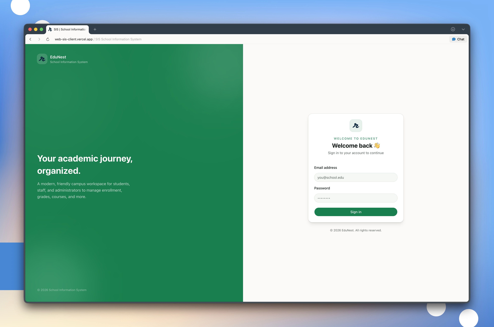

# Project Showcase

A visual walkthrough of EduNest's key screens and workflows using screenshots from `assets/medias/`.

---

## Highlights at a Glance

- **Role-aware UI**: tailored experiences for admin, staff, and student users
- **End-to-end SIS flows**: students, courses, subjects, prerequisites, reservations, and grading
- **Fast navigation**: global command palette with searchable actions and entities
- **Modern UX**: clean dashboard cards, data tables, dialogs, and guided forms

---

## Admin Journey

### 1) Authentication & Entry

Admins authenticate and land on a role-aware workspace.

### 2) Dashboard Overview

The dashboard surfaces at-a-glance system metrics and quick access actions.

### 3) Student Management

Manage student records from a searchable data table.

Inspect full student profiles and related academic details.

### 4) Course & Subject Management

Browse and maintain all degree programs.

Manage course-level metadata and included subjects.

Track subject catalog entries with filtering and actions.

Review subject details and prerequisites in context.

### 5) Academic Operations

Encode and review grades through an efficient grading sheet workflow.

Approve/deny reservation requests with status-aware controls.

### 6) User Administration

Manage system users and account statuses.

Create role-specific accounts from a focused modal flow.

### 7) Power Navigation

Use command palette search to jump quickly across records and pages.

---

## Student Journey

### 1) Enrollment Experience

Students can discover eligible subjects and manage reservations.

### 2) Profile Experience

Students can review personal and academic profile details.

---

## Media Source

All screenshots used in this showcase are stored in:

- `assets/medias/admin/`
- `assets/medias/student/`
