# EduNest — School Information System

A full-featured **School Information System** (SIS) built with **Next.js 16**, **React 19**, and **TanStack React Query**. EduNest provides a modern, role-aware campus workspace for administrators, staff, and students to manage enrollment, courses, subjects, prerequisites, reservations, grading, and more.

> **Built for:** Web Developer Practical Exam — Mini SIS

> ✨ **Teaser:** Role-aware dashboards, robust student-course-subject workflows, and a modern UI with command palette navigation — all in one polished campus system.

---

## Project Showcase

### Admin Experience

| Screen          | Preview                                                                 |
| --------------- | ----------------------------------------------------------------------- |
| Dashboard       | 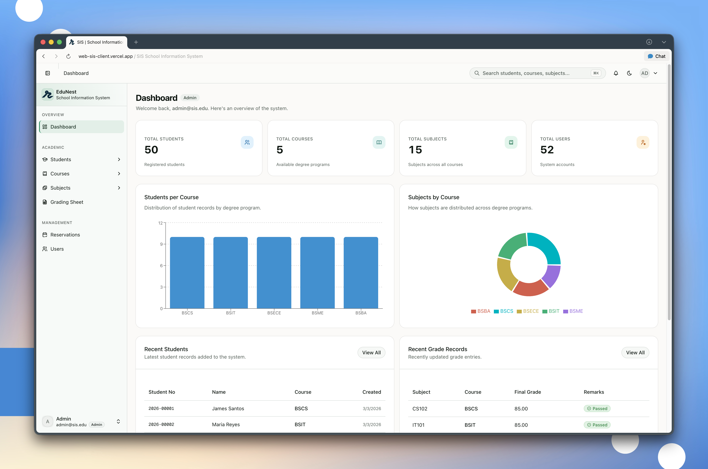              |
| Students Page   | 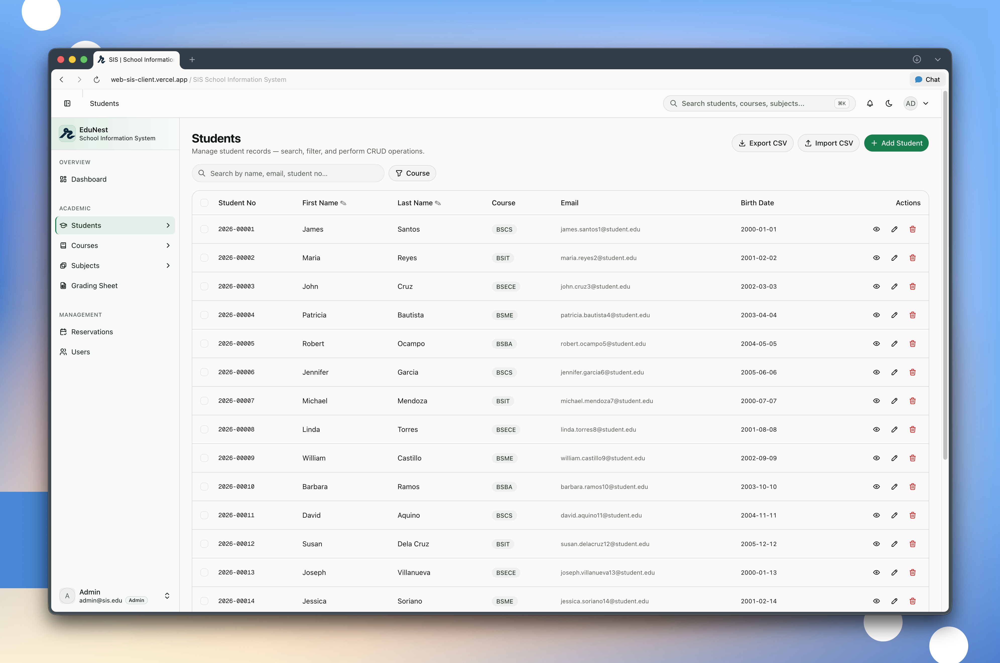                 |
| Student Detail  | 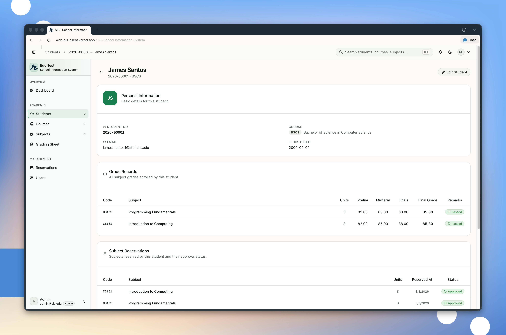 |
| Courses Page    | 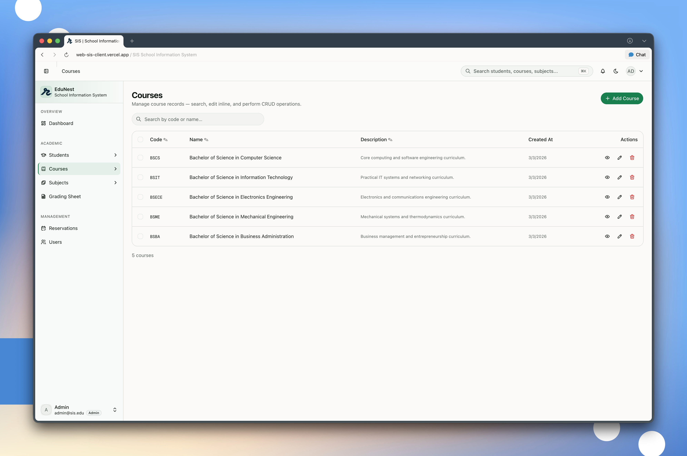                   |
| Course Detail   | 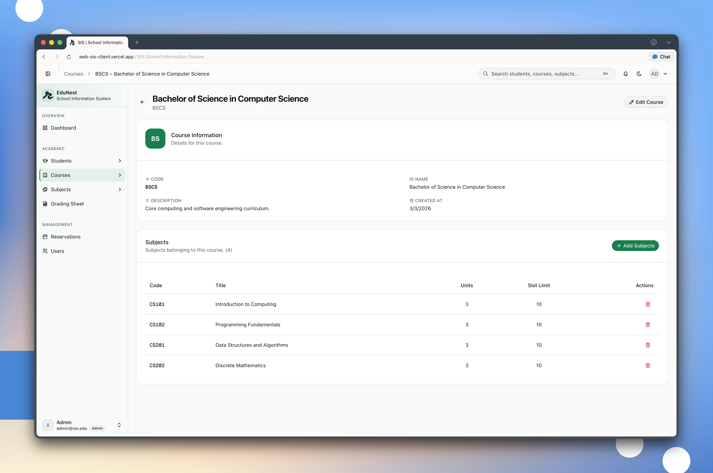   |
| Subjects Page   | 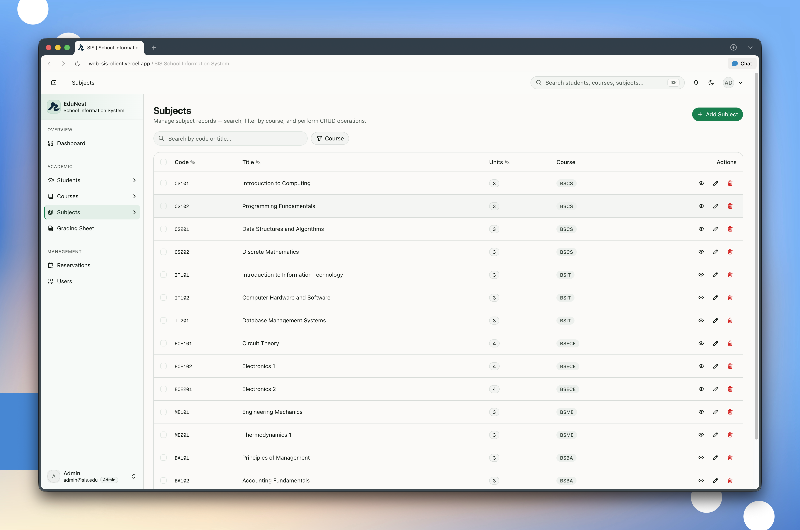                 |
| Subject Detail  | 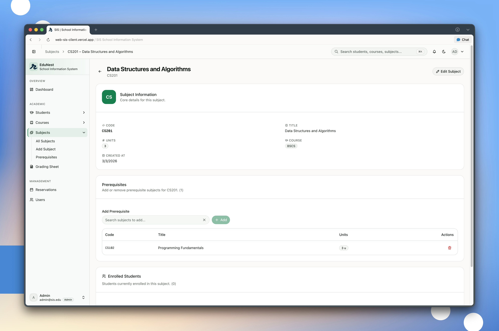 |
| Grading Sheet   | 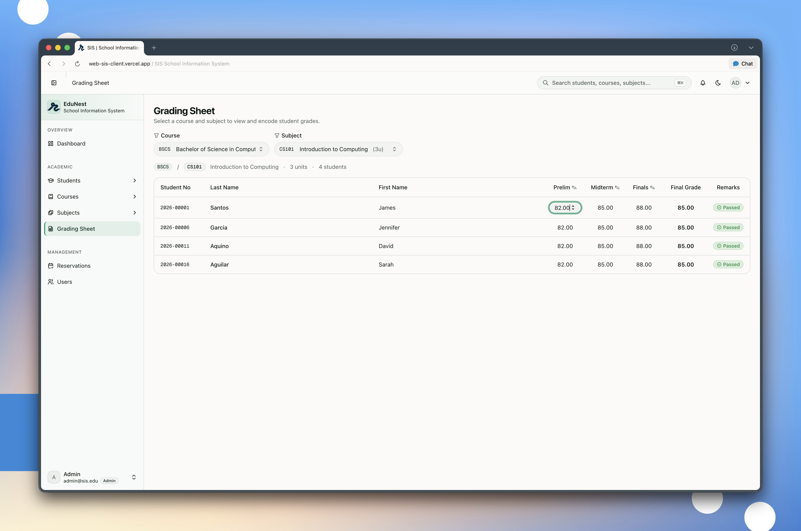                 |
| Reservations    | 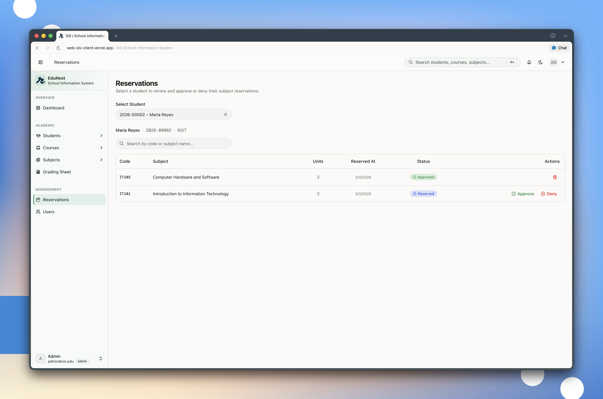           |
| Users Page      | 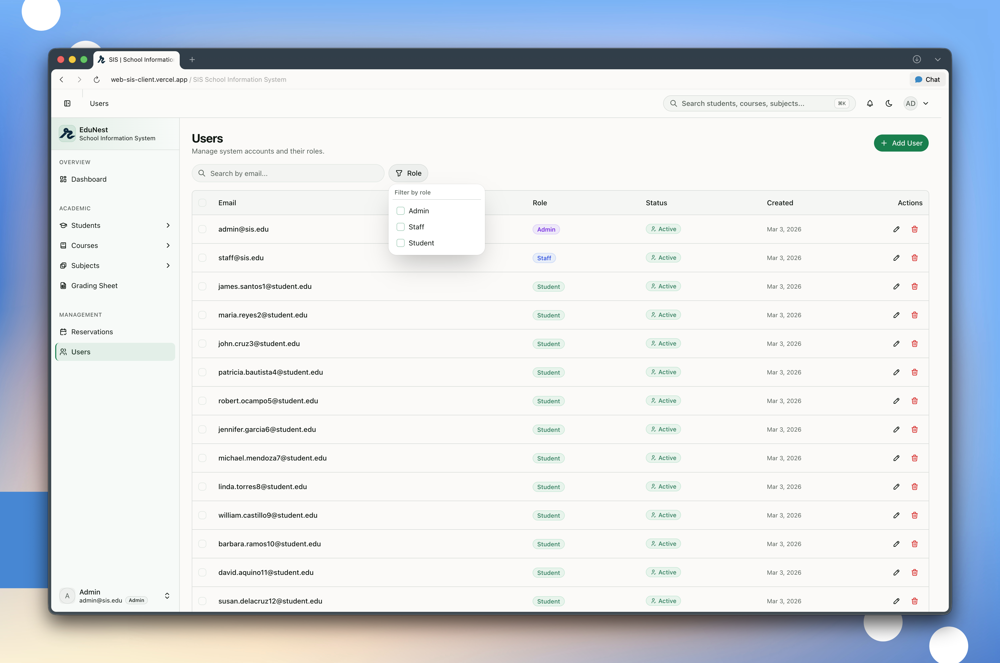                       |
| Add User Dialog | 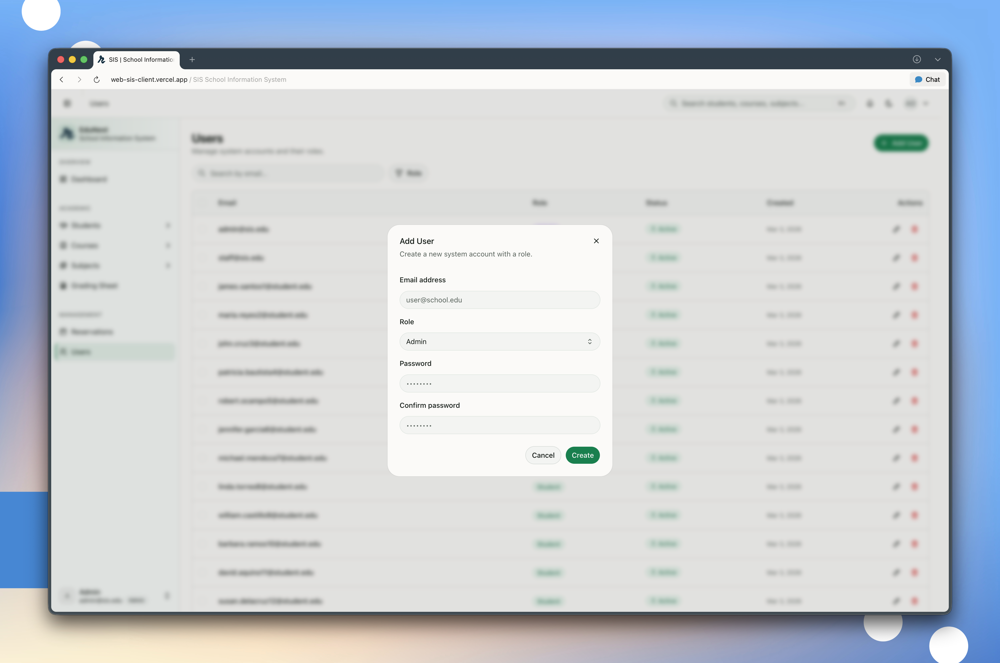             |
| Command Palette | 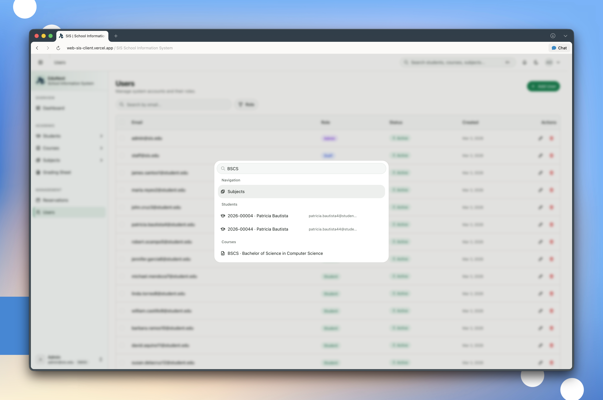      |

### Student Experience

| Screen        | Preview                                                             |
| ------------- | ------------------------------------------------------------------- |
| My Enrollment | 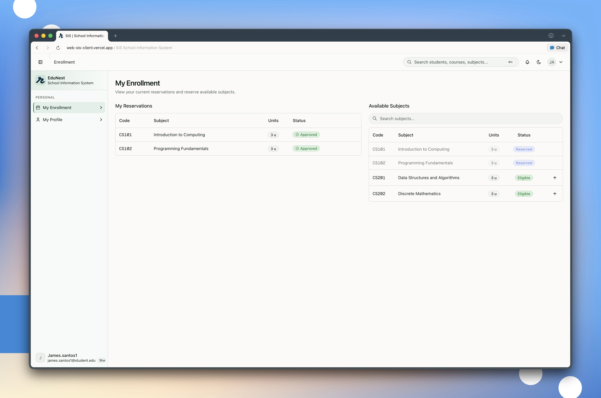 |
| My Profile    | 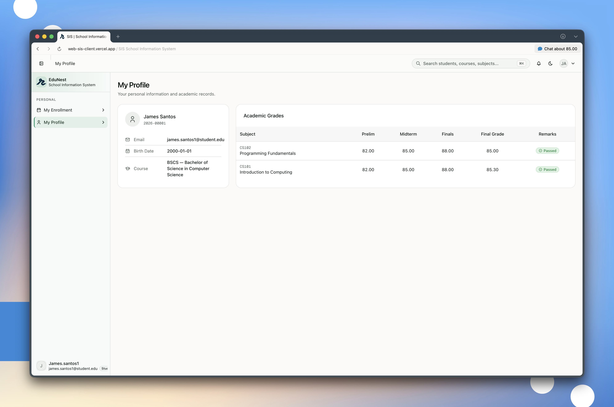       |

For a full visual walkthrough with feature callouts, see the dedicated [Project Showcase](.docs/project-showcase.md).

---

## Tech Stack

| Layer               | Technology                                                                        |
| ------------------- | --------------------------------------------------------------------------------- |
| **Framework**       | [Next.js 16](https://nextjs.org) (App Router, Turbopack)                          |
| **UI**              | React 19, Tailwind CSS 4, [Radix UI](https://www.radix-ui.com) (shadcn/ui)        |
| **State & Data**    | [TanStack React Query v5](https://tanstack.com/query)                             |
| **Icons**           | [@tabler/icons-react](https://tabler.io/icons), [Lucide](https://lucide.dev)      |
| **Theming**         | [next-themes](https://github.com/pacocoursey/next-themes) (light / dark / system) |
| **Notifications**   | [Sonner](https://sonner.emilkowal.ski)                                            |
| **Command Palette** | [cmdk](https://cmdk.paco.me)                                                      |
| **Auth**            | Cookie + localStorage dual persistence, session-based                             |
| **Package Manager** | [Bun](https://bun.sh)                                                             |
| **Language**        | TypeScript 5                                                                      |

---

## Quick Start

```bash
# 1. Clone the repository
git clone <repo-url> && cd sis-client

# 2. Install dependencies
bun install

# 3. Set environment variables (see .docs/getting-started.md for details)
cp .env.example .env.local
# Edit .env.local with your API URL

# 4. Run the dev server (port 4000)
bun run dev

# 5. Build for production
bun run build

# 6. Lint
bun run lint
```

### Environment Variables

| Variable                              | Purpose                                  |
| ------------------------------------- | ---------------------------------------- |
| `NEXT_PUBLIC_ENVIRONMENT`             | `development` / `staging` / `production` |
| `NEXT_PUBLIC_DEV_SERVICE_API_URL`     | Backend API URL for development          |
| `NEXT_PUBLIC_STAGING_SERVICE_API_URL` | Backend API URL for staging              |
| `NEXT_PUBLIC_PROD_SERVICE_API_URL`    | Backend API URL for production           |

### Seed Credentials

| Role    | Email             | Password              |
| ------- | ----------------- | --------------------- |
| Admin   | `admin@sis.edu`   | Admin@1234            |
| Staff   | `staff@sis.edu`   | Staff@1234            |
| Student | `<student-email>` | `<student-birthdate>` |

---

## Key Assumptions & Validation Rules

- **Prerequisite satisfaction:** A prerequisite is considered "passed" when a `grades` row exists with `remarks = 'PASSED'` (i.e., `final_grade >= passing threshold`).
- **Reservation rule:** A student can only reserve subjects in their own course, and **all** prerequisites must be satisfied first. If not, the server returns `400 Bad Request` with the list of missing prerequisites.
- **Grade uniqueness:** One grade record per `(student_id, subject_id, course_id)`.
- **Roles:** `admin` (full access), `staff` (grading only), `student` (enrollment & profile only).

---

## Project Structure

```
sis-client/
├── app/                    # Next.js App Router
│   ├── layout.tsx          # Root layout (ThemeProvider → AuthProvider → Toaster)
│   ├── page.tsx            # Root redirect
│   ├── (auth)/             # Public route group (login)
│   └── (app)/              # Protected route group (dashboard, students, etc.)
├── api-calls/              # API layer — fetch wrappers per entity
├── components/
│   ├── layouts/sidebar/    # AppSidebar, SiteHeader, command palette
│   ├── pages/              # Feature-specific page components
│   ├── shared/             # Cross-cutting reusable components
│   └── ui/                 # 48+ shadcn/ui atomic components
├── config/                 # Environment-aware config (API URLs)
├── contexts/               # React Contexts (Auth, Sidebar)
├── data/
│   ├── interface/          # TypeScript interfaces for all entities
│   └── sidebar/            # Sidebar navigation data + role tags
├── hooks/
│   ├── api/                # 42+ React Query hooks (queries & mutations)
│   └── ...                 # Utility hooks (useAuth, useDebounce, etc.)
├── lib/                    # Utilities (cn, fonts, metadata, constants)
├── providers/              # Context providers (Auth, ReactQuery, Sidebar, Theme)
├── assets/styles/          # globals.css — OKLCH design tokens
├── middleware.ts            # Edge middleware — role-based route protection
└── .docs/                  # 📖 Detailed documentation (you are here)
```

---

## Documentation

All detailed documentation lives in the `.docs/` folder. Each file covers a specific concern:

### Setup & Architecture

| Document                                    | Description                                                  |
| ------------------------------------------- | ------------------------------------------------------------ |
| [Getting Started](.docs/getting-started.md) | Prerequisites, environment setup, dev server, build & lint   |
| [Architecture](.docs/architecture.md)       | App Router layout chain, provider hierarchy, component tiers |
| [Styling & Design System](.docs/styling.md) | OKLCH tokens, theme system, fonts, Tailwind CSS 4            |

### Core Systems

| Document                                        | Description                                                               |
| ----------------------------------------------- | ------------------------------------------------------------------------- |
| [Authentication](.docs/authentication.md)       | Login flow, cookie/localStorage persistence, 401 interceptor, middleware  |
| [Role-Based Access](.docs/role-based-access.md) | Three roles, route protection, sidebar filtering, command palette scoping |
| [API Layer](.docs/api-layer.md)                 | Fetch pattern, environment config, full endpoint reference                |
| [Data Models](.docs/data-models.md)             | All TypeScript interfaces — entities, params, request/response shapes     |
| [State Management](.docs/state-management.md)   | React Query setup, query key factories, custom hooks, cache invalidation  |
| [UI Components](.docs/ui-components.md)         | 48+ component families, shared components, barrel exports                 |
| [Project Showcase](.docs/project-showcase.md)   | Visual walkthrough of core admin and student flows                        |

### Features

| Document                                                     | Description                                                                       |
| ------------------------------------------------------------ | --------------------------------------------------------------------------------- |
| [Dashboard](.docs/features/dashboard.md)                     | Role-specific dashboards — stats, quick actions, recent students                  |
| [Students](.docs/features/students.md)                       | CRUD, data table, import/export, profile, prerequisite status                     |
| [Courses](.docs/features/courses.md)                         | CRUD, data table, course detail, add/remove subjects (detail + edit)              |
| [Subjects](.docs/features/subjects.md)                       | CRUD, data table, subject detail, prerequisites (detail + edit), course filtering |
| [Grades](.docs/features/grades.md)                           | Digital grading sheet, inline editing, upsert, PASSED/FAILED                      |
| [Reservations](.docs/features/reservations.md)               | Admin reservation management, approve/deny/cancel workflow                        |
| [Enrollment](.docs/features/enrollment.md)                   | Student self-service, eligible subjects, prerequisite enforcement                 |
| [Users](.docs/features/users.md)                             | User management, role assignment, soft/hard delete                                |
| [Profile & Settings](.docs/features/profile-and-settings.md) | Student profile, theme settings, account management                               |
| [Command Palette](.docs/features/command-palette.md)         | ⌘K search, role-scoped data indexing, keyboard navigation                         |

---

## License

This project was built as part of a practical exam and is not licensed for redistribution.
